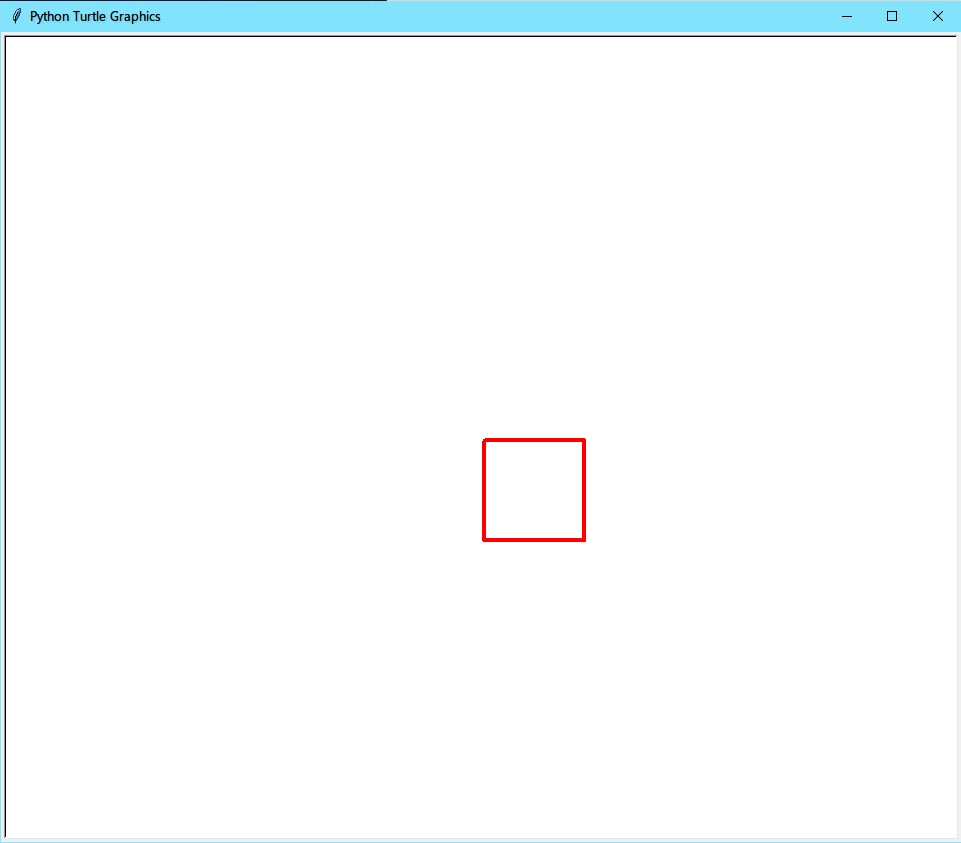
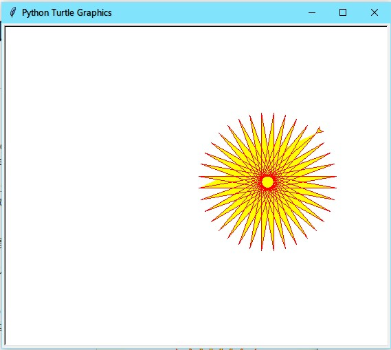

# Python 实例一

---

## turtle 库

&emsp;&emsp;turtle 库，又叫海龟绘图体系，是 Python 用于绘制基本图形的一个很有意思的模块，它内置了几个很简单的函数，通过调用并组合这些函数我们可以绘制出许多高级图形。
&emsp;&emsp;下面我们以实例来演示 turtle 库各个函数的作用。

## 红色四边形

输入：

```Python
import turtle # 调用turtle库

turtle.pensize(4) # 设置画笔宽度
turtle.pencolor('red') # 设置画笔颜色

turtle.forward(100) # 画笔像前移动
turtle.right(90) # 画笔右转
turtle.forward(100) # 继续前进
turtle.right(90)
turtle.forward(100)
turtle.right(90)
turtle.forward(100)
# 此处可用循环代替

turtle.hideturtle() # 隐藏画笔
turtle.mainloop() # 将窗口操作权交予用户
```

输出：

## turtle 库的常用函数

| 函数名                | 作用        |
| --------------------- | ----------- |
| `forward()\fd()`      | 前进        |
| `backward()\bk()`     | 后退        |
| `left()\lt()`         | 左转        |
| `right()\rt()`        | 右转        |
| `goto()\setpos()`     | 定位        |
| `setx()`              | 设置 x 坐标 |
| `sety()`              | 设置 y 坐标 |
| `setheading()\seth()` | 设置朝向    |
| `home()`              | 返回原点    |
| `circle()`            | 画圆        |
| `dot()`               | 画点        |
| `undo()`              | 撤消        |
| `speed()`             | 速度        |
| `pendown()\pd()`      | 画笔落下    |
| `penup()\pu()`        | 画笔抬起    |
| `pensize()\width()`   | 画笔粗细    |
| `pen()`               | 画笔        |
| `color()`             | 颜色        |
| `pencolor()`          | 画笔颜色    |
| `fillcolor()`         | 填充颜色    |
| `filling()`           | 是否填充    |
| `begin_fill()`        | 开始填充    |
| `end_fill()`          | 结束填充    |
| `reset()`             | 重置        |
| `clear()`             | 清空        |
| `write()`             | 书写        |

> 此处仅列出常用函数，完整版请参考[Python 官方文档](https://docs.python.org/zh-cn/3.6/library/turtle.html)

---

## 一些有趣的 turtle 实例

### 太阳花

```Python
import turtle
import time

turtle.color('red','yellow')
turtle.begin_fill()

for _ in range(50):
    turtle.forward(200)
    turtle.left(170)
turtle.end_fill()

turtle.mainloop()
```



### 圣诞树

```Python
from turtle import *
import random
import time

n = 100.0

speed("fastest")
screensize(bg='seashell')
left(90)
forward(3*n)
color("orange", "yellow")
begin_fill()
left(126)

for i in range(5):
    forward(n/5)
    right(144)
    forward(n/5)
    left(72)
end_fill()
right(126)

color("dark green")
backward(n*4.8)
def tree(d, s):
    if d <= 0: return
    forward(s)
    tree(d-1, s*.8)
    right(120)
    tree(d-3, s*.5)
    right(120)
    tree(d-3, s*.5)
    right(120)
    backward(s)
tree(15, n)
backward(n/2)

for i in range(200):
    a = 200 - 400 * random.random()
    b = 10 - 20 * random.random()
    up()
    forward(b)
    left(90)
    forward(a)
    down()
    if random.randint(0, 1) == 0:
            color('tomato')
    else:
        color('wheat')
    circle(2)
    up()
    backward(a)
    right(90)
    backward(b)

time.sleep(60)
```

## 

## 结语

&emsp;&emsp;turtle 库是 Python 的一个非常有意思的库，闲暇无聊的时候可以使用这个库创作出很多有意思的图形，图像，也可以加深对代码的理解。
